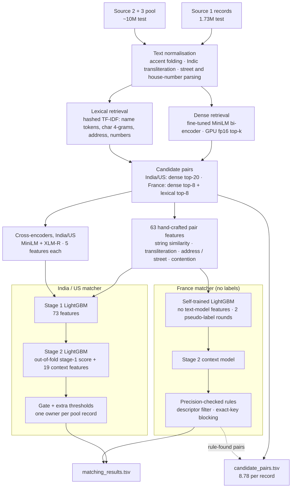
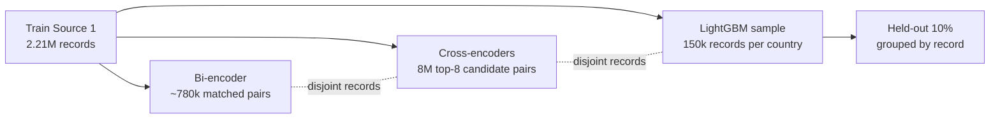

# Business Entity Resolution at Scale — Amazon ML Challenge 2026

Link every business record in **Source 1** to all of its duplicates in the **Source 2 / Source 3** pool, across India, the US and
**France (a country with no training labels)**. The pipeline combines fine-tuned transformer retrieval, cross-encoder re-scoring,
a two-stage LightGBM matcher, semi-supervised self-training and precision-checked blocking rules.

| | Result |
|---|---|
| **Final leaderboard (macro F0.5)** | **0.983** (public 0.98275) — top 1% of 90,000+ participants |
| Held-out validation, India / US | 0.9894 / 0.9869 |
| France (unseen country, estimated from the leaderboard) | ≈ 0.95 |
| Candidate pairs submitted | 15.2M, **8.78 per Source 1 record** (from ~6.7 trillion same-country pairs) |
| Data processed | 24.2M records (train 12.5M, test 11.7M) |

Only the challenge data is used — no external data, lookups or APIs. Models: `paraphrase-multilingual-MiniLM-L12-v2`
(Apache-2.0, 118M params) and `xlm-roberta-base` (MIT, 278M params).

---

## Contents
1. [Problem](#1-problem)
2. [Architecture](#2-architecture)
3. [Pipeline in detail](#3-pipeline-in-detail)
4. [The unseen country: France](#4-the-unseen-country-france)
5. [Results](#5-results)
6. [What did not work](#6-what-did-not-work)
7. [Repository layout](#7-repository-layout)
8. [Reproducing the submission](#8-reproducing-the-submission)
9. [Engineering notes](#9-engineering-notes)

---

## 1. Problem

| | Source 1 (queries) | Source 2 | Source 3 | Countries |
|---|---|---|---|---|
| Train | 2,206,821 | 5.03M | 5.29M | India, US |
| Test | 1,732,544 | 4.89M | 5.08M | India 46.8%, US 38.3%, **France 15.0% (not in train)** |

- Each Source 1 record has 0–11 true matches in the pool (mean 3.46, 5.6% have none); 7.64M labelled matches in train.
- **One-to-one:** no pool record belongs to more than one Source 1 record, and ~26% of the pool are distractors.
- Records are noisy: typos, abbreviations, lost accents, trading names (DBA), domain-style names (`boblyceecom`), empty addresses,
  shuffled address components, and Indic scripts (Devanagari, Telugu, Tamil, Gujarati, ...) mixed with Latin.
- **Metric:** macro F0.5 over Source 1 records — precision counts twice as much as recall, and a record with no true match scores 1
  only if nothing is predicted.
- Two outputs: `matching_results.tsv` (the matches) and `candidate_pairs.tsv` (the blocked candidate set; smaller is better).

## 2. Architecture



### Leakage-safe training data

Every model is trained on Source 1 records the next model never sees, so each score fed forward as a feature is out-of-sample,
and validation measures true generalisation.



Held-out validation predicted the leaderboard to within 0.001 (0.906 vs 0.905, 0.924 vs 0.924, India/US 0.9802 vs 0.9805),
so every submission could be estimated before it was uploaded.

## 3. Pipeline in detail

### 3.1 Normalisation — `textnorm.py`, `translit.py`, `street.py`
- Case/accent folding, legal-form handling (`Pvt Ltd`, `LLC`, `SARL`, `SAS` ...), French abbreviations (`St`→`saint`, `Ets`→`etablissements`)
  enabled only for France (`ER_LOCALE=France`).
- **Transliteration without external libraries:** Indic characters are mapped to Latin phonetic skeletons from their Unicode
  character names, so `गुड ट्रेडिंग प्राइवेट लिमिटेड` and `Good Trading Private Limited` produce the same skeleton.
- Street parsing extracts house number and street name from free-form addresses in any component order.

### 3.2 Blocking (candidate generation)

**Bi-encoder — contrastive fine-tuning with in-batch negatives** (`bi_train.py`, `dense_topk.py`)

| Setting | Value |
|---|---|
| Base model | `paraphrase-multilingual-MiniLM-L12-v2` |
| Loss | symmetric InfoNCE: similarity × 20 (temperature 0.05), cross-entropy in both directions |
| Negatives | every other record in the batch; **batches hold one country**, so negatives are same-language look-alikes |
| Training | ~780k matched pairs · batch 512 · AdamW lr 3e-5 · 5% warm-up + linear decay · bf16 · 1 epoch (1,516 steps, ~6 min on an A100) |
| Search | fp16 embeddings, exact GPU matrix-multiply top-k in blocks, per country |

| Retrieval recall (held-out) | top-10 | top-50 |
|---|---|---|
| Off-the-shelf MiniLM, India | 61.7% | 67.0% |
| **Fine-tuned, India** | **98.2%** | 99.4% |

**Lexical retrieval** (`lexblock.py`): hashed TF-IDF over name tokens, name character 4-grams, address tokens and house numbers.
Order-insensitive and language-agnostic; used for France, where it recovers variants the India/US-trained retriever misses.

**Exact-key blocking** (`fr_block*.py`): hash keys on normalised name + house number + street (plus domain, acronym and
trading-name keys) — constant cost per record, so it scales to billions of records.

### 3.3 Pair features — `features.py`, `features2.py`, `features_add.py`, `features_add2.py`

63 hand-crafted features per candidate pair:

| Group | Count | Examples |
|---|---|---|
| String similarity | 40 | fuzzy ratios / token-set / Jaro-Winkler on raw and normalised names and addresses, char 3-gram Jaccard, retrieval score, rank, gap |
| Transliteration, address components, contention | 18 | skeleton similarity, state/region match, empty-address flags, **how many Source 1 records claim the same candidate and their score gaps** |
| Street / house number | 5 | parsed number equality, street similarity, number-shift size |

### 3.4 Cross-encoders — `ce_train2.py`, `ce_score2.py`, `features_ce.py`

Supervised fine-tuning on **hard negatives mined by the retriever**: for each training record, every one of its top-8 retrieved
candidates is a training pair labelled 1 (true match) or 0.

| Model | Pairs | Settings |
|---|---|---|
| MiniLM | 4.5M, then continued on 8M fresh pairs | BCE loss · batch 256 · max 128 tokens · lr 4e-5 then 2e-5 · 3% warm-up + linear decay · bf16 |
| XLM-R base | 8M | same, lr 2e-5 (final loss 0.028) |

Each model adds 5 features: logit, rank within the query, gap to the query's best, margin, query mean.
The cross-encoder feature lifted held-out LightGBM from 0.972 / 0.976 to 0.984 / 0.983 (India / US).

### 3.5 Two-stage matcher and decision — `train_lgbm.py`, `stage2.py`, `predict_final.py`
- **Stage 1:** LightGBM on 73 features (63 hand-crafted + 2 × 5 cross-encoder), group split by Source 1 record.
- **Stage 2:** LightGBM on 5-fold out-of-fold stage-1 probabilities plus 19 per-query context features (rank, gap to the top
  candidate, similarity to the top candidate and to other confident candidates, same-name counts, empty-address flags).
- **Decision:** a *gate* threshold for the best candidate and a separate *extra* threshold for additional matches, tuned per
  country on the exact macro F0.5; each pool record is kept only for its highest-scoring Source 1 record.

## 4. The unseen country: France

France is 15% of the test set, has no labels, and is harder: names are templates (`Nantes Club SARL`), many records share a name
within a city, and "sibling" businesses sit at the same address differing by one word or legal form.

**Rehearsal.** To test ideas without French labels, the pipeline was trained on the US only and evaluated on India, as a stand-in
unseen country:

| Finding | F0.5 on India (trained on US) |
|---|---|
| Hand-crafted features only | 0.903 |
| + cross-encoder trained without the target country | 0.853 (hurts) |
| + LightGBM self-training on pseudo-labels (p ≥ 0.95 / ≤ 0.05, 2 rounds) | 0.914 |
| + stage-2 context model | 0.918 |

So France uses **no text-model features**, a **self-trained** LightGBM and the stage-2 context model (`france_s2.py`).

**Retrieval recall was the bottleneck.** Pool coverage by dense top-8 was 79.4% in France (India 91.8%, US 94.6%); adding lexical
top-8 raised it to 88.0% and France F0.5 from ~0.907 to ~0.920.

**Precision-checked rules** (`fr_compete.py`, `fr_block*.py`). Each rule was first measured on labelled US/India data, and applied
to France only. A rule only assigns a pool record nobody owns, and only when exactly one Source 1 record qualifies.

| Rule | Train precision US / India |
|---|---|
| Drop extra matches whose name swaps one descriptive word (siblings) | — (France-specific pattern) |
| Empty address, normalised name matches exactly one record | 96.6% / 97.5% |
| Same name, same house number and street | 99.95% / 99.0% |
| Typo-tolerant name, same number and street | 99.7% / 98.5% |
| One name word dropped, same number and street | 99.9% / 96.9% |
| Same street, house number missing | 99.5% / 98.9% |
| Domain / handle form at the record's address | 99.98% / 99.8% |
| Acronym at the record's address | 100% / 100% |
| Invented one-word trading name at the record's address | 98.3% / 98.3% |

Together these took France from ~0.920 to ~0.952.

## 5. Results

| Step | Leaderboard |
|---|---|
| Baseline: off-the-shelf MiniLM top-10 + LightGBM | 0.726 |
| Dense + lexical union, LightGBM, metric-exact thresholds | 0.905 |
| + cross-encoder stacking | 0.924 |
| Fine-tuned bi-encoder (K = 8) + transliteration and contention features | 0.966 |
| + street / house-number features | 0.969 |
| + stage-2 model, larger cross-encoder | 0.973 |
| K = 20 for India/US, France self-training | 0.975 |
| + XLM-R cross-encoder | 0.976 |
| + France lexical candidates | 0.978 |
| + France descriptor filter and empty-address rule | 0.980 |
| + exact-key blocking (France) | 0.9816 |
| + typo-tolerant and word-drop keys | 0.9819 |
| + no-number, domain, acronym, trading-name keys (public) | 0.98275 |
| **Final leaderboard** | **0.983** |

## 6. What did not work

| Idea | Outcome |
|---|---|
| Synthetic French training data from a learned noise generator | +0.054 on the synthetic benchmark, **−0.008** on the real leaderboard |
| Cross-encoders (MiniLM, XLM-R, letter-cipher augmentation) for the unseen country | 0.820–0.869 vs 0.903 without, in the rehearsal |
| Widening France candidates (dense top-20/50, lexical top-16) | extra candidates were mostly same-name businesses on other streets (0.977 vs 0.978) |
| Applying the France rules to India/US | −0.0008: the stronger model already rejects those pairs correctly |
| "Same name, same street, different house number" | 21% precision on US train |
| Shifting the France threshold to a target match rate | saturated, no gain |

## 7. Repository layout

```
├── README.md
├── requirements.txt
├── docs/METHODOLOGY.md        # method write-up submitted with the solution
└── src/
```

| Stage | Scripts |
|---|---|
| Normalisation | `textnorm.py`, `translit.py`, `street.py`, `nameops.py` |
| Retrieval | `bi_train.py`, `dense_topk.py`, `lexblock.py` |
| Features | `features.py`, `features2.py`, `features_add.py`, `features_add2.py`, `features_ce.py`, `featio.py` |
| Cross-encoders | `ce_train2.py`, `ce_score2.py` |
| India / US matcher | `train_lgbm.py`, `stage2.py`, `predict_final.py` |
| France matcher and rules | `france_s2.py`, `fr_compete.py`, `fr_block.py`, `fr_block2.py`, `fr_block3.py`, `fr_block4.py`, `fr_block5.py` |
| Output | `merge_france.py`, `build_candidates.py`, `validate.py`, `metric.py` |

## 8. Reproducing the submission

**Setup.** Python 3.12, one NVIDIA GPU (A100 / H100 / H200) and ~24–30 CPU cores. Run everything from the repository root with the
challenge files in `data/train/*.tsv` and `data/test/*.tsv`.

```bash
pip install -r requirements.txt
```

**1. Retrieval**
```bash
python src/bi_train.py --data data --out out_bi                                               # -> out_bi/bi/model
python src/dense_topk.py --split train --data data --out out_bi   --model out_bi/bi/model --max_queries 150000
python src/dense_topk.py --split train --data data --out out_full --model out_bi/bi/model --k 20   # all train records (contention features, cross-encoder pairs)
python src/dense_topk.py --split test  --data data --out out_bi   --model out_bi/bi/model
python src/lexblock.py --split train --data data --out out_bi
python src/lexblock.py --split test  --data data --out out_bi
```
Each experiment directory below reuses these lists: create it and link `out_bi/topk_*.npz` and `out_bi/work` into it.

**2. India / US matcher** (directory `out_k20x`, 20 dense candidates)
```bash
for S in train test; do
  python src/features2.py     --split $S --data data --out out_k20x --kd 20 --kl 0 --countries India,US
  python src/features_add.py  --split $S --data data --out out_k20x --full out_full --k 20 --countries India,US
  python src/features_add2.py --split $S --data data --out out_k20x --countries India,US
done
python src/ce_train2.py --data data --out out_bi --full out_full --n_pairs 4500000 --dir_name ce2
python src/ce_train2.py --data data --out out_bi --full out_full --n_pairs 8000000 --model out_bi/ce2/model --lr 2e-5 --seed 1 --dir_name ce3
python src/ce_train2.py --data data --out out_bi --full out_full --n_pairs 8000000 --model xlm-roberta-base --lr 2e-5 --dir_name ce_xlm_iu
for S in train test; do
  python src/ce_score2.py   --data data --out out_k20x --split $S --countries India,US --model_dir out_bi/ce3/model --score_dir out_k20x/ce3
  python src/features_ce.py --split $S --out out_k20x --countries India,US --score_dir out_k20x/ce3
  python src/ce_score2.py   --data data --out out_k20x --split $S --countries India,US --model_dir out_bi/ce_xlm_iu/model --score_dir out_k20x/ce_xlm
  python src/features_ce.py --split $S --out out_k20x --countries India,US --score_dir out_k20x/ce_xlm --dest feat_cex
done
python src/train_lgbm.py --data data --out out_k20x
python src/stage2.py --data data --out out_k20x --test --test_countries India,US --dest out_k20x/stage2
python src/predict_final.py --data data --out out_k20x --name final --countries India,US \
       --pred_dir out_k20x/stage2 --decision out_k20x/stage2/decision.json
```

**3. France matcher** (directory `out_lex`, dense top-8 + lexical top-8)
```bash
python src/features2.py     --split train --data data --out out_lex --kd 8 --kl 8 --countries India,US
python src/features_add.py  --split train --data data --out out_lex --full out_full --k 8 --countries India,US
python src/features_add2.py --split train --data data --out out_lex --countries India,US
export ER_LOCALE=France
python src/features2.py     --split test --data data --out out_lex --kd 8 --kl 8 --countries France
python src/features_add.py  --split test --data data --out out_lex --full out_lex --k 8 --countries France
python src/features_add2.py --split test --data data --out out_lex --countries France
unset ER_LOCALE
python src/france_s2.py --out out_lex --dest out_lex/france_s2
python src/merge_france.py out_k20x/submissions/final/matching_results.tsv out_lex/france_s2/france_rows.tsv base.tsv
```

**4. France rules**
```bash
python src/fr_compete.py base.tsv s1.tsv AC
CTRY=France python src/fr_block.py  apply s1.tsv s2.tsv
CTRY=France python src/fr_block2.py apply s2.tsv s3.tsv
CTRY=France BMODE=del python src/fr_block3.py apply s3.tsv s4.tsv
CTRY=France python src/fr_block4.py apply s4.tsv s5.tsv
NREL=domain CTRY=France python src/fr_block5.py apply s5.tsv s6.tsv
NREL=acro   CTRY=France python src/fr_block5.py apply s6.tsv s7.tsv
NREL=pseudo CTRY=France python src/fr_block5.py apply s7.tsv matching_results.tsv
```
Measure a rule's precision on labelled data first, e.g. `python src/fr_block.py eval US`.

**5. Candidate file and checks**
```bash
python src/build_candidates.py --matches matching_results.tsv --dense <dense top-8 candidate file> \
       --lex out_bi/topk_lex_test_France.npz --out candidate_pairs.tsv
python src/validate.py --matching matching_results.tsv --candidate candidate_pairs.tsv --test-dir data/test
```
`<dense top-8 candidate file>` is the `candidate_pairs.tsv` that `predict_final.py` writes for a K = 8 feature set (e.g. `out_bi`).
The candidate file keeps every retrieved candidate the pipeline used; every predicted match is contained in it.

## 9. Engineering notes
- Hardware: Lightning AI Studios — A100 40GB (30 vCPU, 216 GB RAM) and H200 (24 vCPU).
- Throughput: encoding ~13k records/s (fp16); retrieval for the whole test set ~35 min; features 30–45k pairs/s with
  multiprocessing; cross-encoder training ~3k pairs/s, scoring ~9k pairs/s.
- Every long job is checkpointed and resumable (embedding shards, search parts, feature chunks, training checkpoints).
- Compliance: open models ≤ 278M parameters (Apache-2.0 / MIT), no external data.
